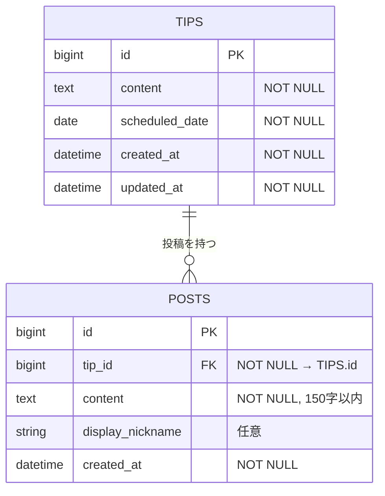

### ER図
（ER図のスクリーンショットの画像）

### 本サービスの概要（700文字以内）
1. 毎朝 30 秒で TIP（話し方の型）を読み、150 字でドリルへの回答を投稿できる Web アプリです。
2. 投稿後に自己評価(本リリース機能)し、他ユーザーの回答と比較することで短時間で“型”を習得します。
3. テキスト習慣を土台に、将来は音声提出(本リリース後)や AI フィードバック(本リリース後)へ段階的に拡張できます。

### MVPで実装する予定の機能
- [x]  TIP表示機能（今日のひとことページ）
- [x]  ドリル投稿機能（日常のひとコマ練習ページ）（POST）
- [x]  ドリル投稿一覧の表示機能（みんなのひとことページ）（POST）
- [x]  TIP一覧の表示機能（今日のひとこと一覧ページ）

### ER図の注意点
- [x] プルリクエストに最新のER図のスクリーンショットを画像が表示される形で掲載できているか？
- [x] テーブル名は複数形になっているか？
- [x] カラムの型は記載されているか？
- [x] 外部キーは適切に設けられているか？
- [x] リレーションは適切に描かれているか？多対多の関係は存在しないか？
- [x] STIは使用しないER図になっているか？
- [x] Postsテーブルにpost_nameのように"テーブル名+カラム名"を付けていない

