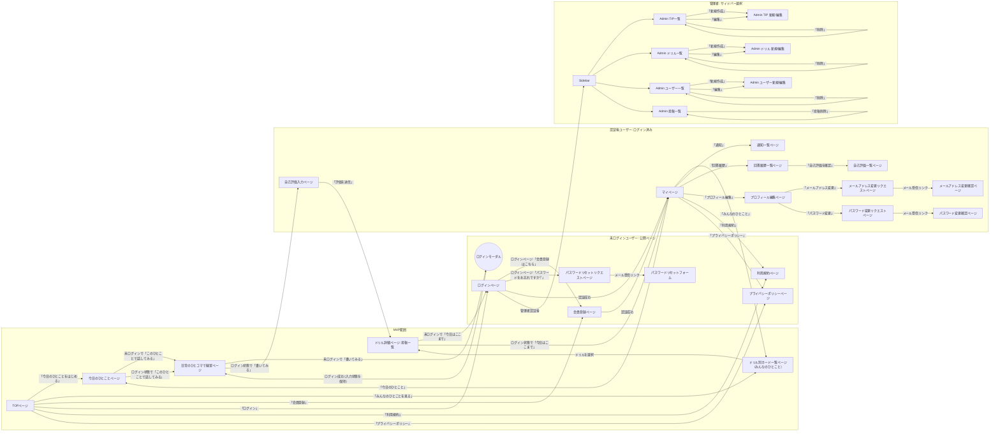

```mermaid
flowchart LR
  %% MVP範囲のハイライト
  subgraph MVP["MVP範囲"]
    A[TOPページ]
    B[今日のひとことページ]
    C[日常のひとコマで練習ページ]
    D1[ドリル別カード一覧ページ（みんなのひとこと）]
    D2[ドリル詳細ページ: 投稿一覧]
  end

  %% 未ログインユーザー（公開ページ）
  subgraph Public["未ログインユーザー: 公開ページ"]
    A -->|「今日のひとことをはじめる」| B
    A -->|「みんなのひとことを見る」| D1
    A -->|「会員登録」| U1[会員登録ページ]
    A -->|「ログイン」| U2[ログインページ]
    U2 -->|ログインページ:「会員登録はこちら」| U1
    U2 -->|ログインページ:「パスワードをお忘れですか？」| U12[パスワードリセットリクエストページ]
    U12 -->|メール受信リンク| U13[パスワードリセットフォーム]
    B -->|未ログインで「このひとことで話してみる」| C
    C -->|未ログインで「書いてみる」| LoginModal((ログインモーダル))
    LoginModal -->|"ログイン成功 (入力状態を保持)"| C
    D1 -->|ドリルを選択| D2
    D2 -->|未ログインで「今日はここまで」| U2
    %% フッターリンク（公開）
    A -->|「利用規約」| U5[利用規約ページ]
    A -->|「プライバシーポリシー」| U4[プライバシーポリシーページ]
  end

  %% 認証後ユーザー（ログイン済み）
  subgraph Auth["認証後ユーザー: ログイン済み"]
    U2 & U1 -->|認証成功| DB[マイページ]
    DB -->|「今日のひとこと」| B
    DB -->|「みんなのひとこと」| D1
    DB -->|「通知」| N[通知一覧ページ]
    DB -->|「回答履歴」| M1[回答履歴一覧ページ]
    M1 -->|「自己評価を確認」| M2[自己評価一覧ページ]
    B -->|ログイン状態で「このひとことで話してみる」| C
    C -->|ログイン状態で「書いてみる」| E[自己評価入力ページ]
    E -->|「評価を送信」| D2
    D2 -->|ログイン状態で「今日はここまで」| DB
    %% プロフィール編集と設定
    DB -->|「プロフィール編集」| U3[プロフィール編集ページ]
    U3 -->|「メールアドレス変更」| U8[メールアドレス変更リクエストページ]
    U3 -->|「パスワード変更」| U9[パスワード変更リクエストページ]
    U8 -->|メール受信リンク| U10[メールアドレス変更確認ページ]
    U9 -->|メール受信リンク| U11[パスワード変更確認ページ]
    %% フッターリンク（認証済み）
    DB -->|「利用規約」| U5
    DB -->|「プライバシーポリシー」| U4
  end

  %% 管理者画面
  subgraph Admin["管理者: サイドバー選択"]
    side[Sidebar]
    side --> AD1[Admin TIP一覧]
    side --> AD3[Admin ドリル一覧]
    side --> AD5[Admin ユーザー一覧]
    side --> AD7[Admin 投稿一覧]
    AD1 -->|「新規作成」| AD2[Admin TIP 新規/編集]
    AD1 -->|「編集」| AD2
    AD1 -->|「削除」| AD1
    AD3 -->|「新規作成」| AD4[Admin ドリル 新規/編集]
    AD3 -->|「編集」| AD4
    AD3 -->|「削除」| AD3
    AD5 -->|「新規作成」| AD6[Admin ユーザー新規/編集]
    AD5 -->|「編集」| AD6
    AD5 -->|「削除」| AD5
    %% モデレーション機能
    AD7 -->|「非公開設定」| AD7
    AD7 -->|「コメント非表示」| AD7
    AD7 -->|「投稿削除」| AD7
  end

  %% 管理者アクセス
  U2 -->|管理者認証後| side

```
