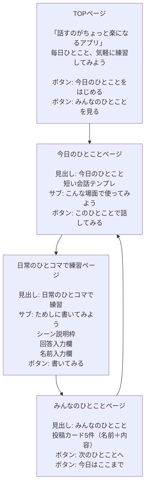

```mermaid
flowchart TD

  %% TOPページ
  A[TOPページ<br><br>「話すのがちょっと楽になるアプリ」<br>毎日ひとこと、気軽に練習してみよう<br><br>ボタン: 今日のひとことをはじめる<br>ボタン: みんなのひとことを見る] --> B

  %% 今日のひとことページ
  B[今日のひとことページ<br><br>見出し: 今日のひとこと<br>短い会話テンプレ<br>サブ: こんな場面で使ってみよう<br>ボタン: このひとことで話してみる] --> C

  %% 日常のひとコマで練習ページ
  C[日常のひとコマで練習ページ<br><br>見出し: 日常のひとコマで練習<br>サブ: ためしに書いてみよう<br>シーン説明枠<br>回答入力欄<br>名前入力欄<br>ボタン: 書いてみる] --> D

  %% みんなのひとことページ
  D[みんなのひとことページ<br><br>見出し: みんなのひとこと<br>投稿カード5件（名前＋内容）<br>ボタン: 次のひとことへ<br>ボタン: 今日はここまで] --> B
```
